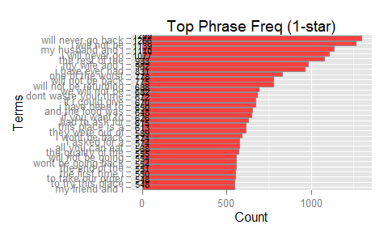

# Report for Data Science Capstone Project
Paul Lim  
20 Nov 2015  

<style type="text/css">

/* http://rmarkdown.rstudio.com/html_document_format.html */
/* https://www.rstudio.com/wp-content/uploads/2015/03/rmarkdown-reference.pdf */
/* http://stackoverflow.com/questions/30446905/rmarkdown-font-size-and-header */


body, td {
   font-size: 12px;
}
code.r{
  font-size: 10px;
}
pre {
  font-size: 8px
}

h1 {
  font-size: 22px;
}

h2 {
  font-size: 20px;
}

h3 {
  font-size: 18px;
}

h4 {
  font-size: 16px;
}

h5 {
  font-size: 14px;
}

h6 {
  font-size: 12px;
}

</style>


# Introduction
Sentiment analysis is the computational study of opinions, sentiments and emotions expressed in text. Using  natural language processing (NLP) and text analysis, I aim to answer questions regarding the Yelp Dataset:

* What are the most-frequently used phrases in reviews? 
* What motivation can we infer for customers to write reviews, from the most-frequently used phrases in reviews?

The answers to these questions may be of interest to business owners to identify business strengths and weaknesses. Such analysis can also be used to predict how key review phrases may influence the review ratings. 

# Methods 
For the capstone project, I am more interested in and will focus on restaurant businesses. The report will walk through the steps of reading the data, sampling it, pre-processing the data, constructing the word-frequency lookup table from review data, and visualizing the word frequencies. A sample of 1,000 restaurant reviews is taken to perform exploratory analysis. We need to build the corpus and term-document matrix from the sample of reviews. To do this, we perform the following steps: convert text to lower case, remove punctuation, remove numbers, remove white space but I skip stemming and removal of sparse terms to consider all words

Finally, we build and sort data frames of 3-Grams and 4-Grams Tokens before plotting bar plots and wordclouds for visualization and analysis. The data visualization and analysis of the most-frequently-used phrases (for different review star-ratings) will be used to answer the questions.

## Preparing the Data
The dataset is downloaded from site: [Yelp Dataset Challenge Round 6 Data](https://d396qusza40orc.cloudfront.net/dsscapstone/dataset/yelp_dataset_challenge_academic_dataset.zip) [575 MB] and unpacked into a subfolder "data". For this study, I am interested only in the review and business data. The code for reading and preparing data is found at [GitHub](https://github.com/limminchim/dsscapstone-005)

## Exploratory Analysis

```r
# get current working dir
wdir <- getwd()
# read list of restaurants from RDS file
rds_restaurant_details_filepath <- paste(wdir, "biz_restaurants.rds", sep="/mydata/")
df_biz_restaurants <- readRDS(file = rds_restaurant_details_filepath)
# read reviews from RDS file
rds_rest_reviews_filepath <- paste(wdir, "restaurant_reviews.rds", sep="/mydata/")
df_rest_reviews <- readRDS(file = rds_rest_reviews_filepath)
numRestaurants <- length(unique(df_biz_restaurants$business_id))
numReviews <- nrow(df_rest_reviews)
```
17558 restaurants are still in operation, with a total of 883750 reviews. From a barplot of the distribution of review ratings, it is observed that the number of ratings drop with the star-rating itself. 


### Extracting 1-, 2-, 3-, 4- and 5-star review sample

From a sample of 1000 reviews, we extracted 80 1-star, 96 2-star, 160 3-star, 314 4-star and 350 5-star reviews.

### Top 50 words used in review samples
From the wordclouds of top 50 words used in review samples, it is observed that:

* The common positive descriptive words used are "good", "great", "best" and "like".
* The common business-related nouns are "food", "place", "service" and "experience".
* 1- and 2-star reviews contain lots of negative words (e.g. never, didnt, wasnt, dont etc); food-related references (e.g. buffet, chicken, fries, chesse, salad, pizza etc); service-related references (e.g. people, manager, experience, waitress, order, tables etc). 
* 3-, 4- and 5-star reviews contain more of postive descriptive words (e.g. good, best, love, fresh, nice, great, excellent etc); but much fewer references to specific food or service.
* Among the top words, there are no reference to attributes like car parks, wi-fi, coat check, music, distance, convenience etc.

## Most Frequently-Used Phrases
Instead of merely looking at frequently-used single words, I want to find the most frequently-used phrases (in particular 3- and 4-word phrases). The following steps are taken to prepare the word-frequency lookup table from the samples: convert to lower case, remove punctuation, remove numbers, remove white space, but skip stemming and removal of sparse terms, in order to consider all words used in reviews


```r
corpus <- Corpus(VectorSource(df_review_samples$text))
corpus <- tm_map(corpus, content_transformer(tolower)) 
corpus <- tm_map(corpus, removePunctuation) 
corpus <- tm_map(corpus, removeNumbers) 
corpus <- tm_map(corpus, stripWhitespace)

# Tokenizing the corpus and construct N-Grams
# Will only construct 3-gram, and 4-gram tokenizers as 1-gram and 2-gram does not seem to show much insight into the question of interest
# Tokenizer for n-grams and passed on to the term-document matrix constructor
TdmTri <- TermDocumentMatrix(corpus, control = list(tokenize = TrigramTokenizer))
TdmQuad <- TermDocumentMatrix(corpus, control = list(tokenize = QuadgramTokenizer))
# Remove NAs
TdmTri <- slam::rollup(TdmTri, 2, na.rm=TRUE, FUN = sum)
TdmQuad <- slam::rollup(TdmQuad, 2, na.rm=TRUE, FUN = sum)
# Term frequency
freq.tri <- rowSums(as.matrix(TdmTri))
freq.quad <- rowSums(as.matrix(TdmQuad))
##sort
freq.tri <- sort(freq.tri, decreasing = TRUE)
freq.quad <- sort(freq.quad, decreasing = TRUE)
# Create the top X data frames from the matrices
topnum <- 30
df.freq.tri <- data.frame("Term"=names(head(freq.tri,topnum)), "Frequency"=head(freq.tri,topnum))
df.freq.quad <- data.frame("Term"=names(head(freq.quad,topnum)), "Frequency"=head(freq.quad,topnum))
# Reorder levels for better plotting
df.freq.tri$Term1 <- reorder(df.freq.tri$Term, df.freq.tri$Frequency)
df.freq.quad$Term1 <- reorder(df.freq.quad$Term, df.freq.quad$Frequency)
# clear memory
rm(TdmTri)
rm(TdmQuad)
```
 

It is observed that the most-frequently used phrases are:

* Tri-grams:  "the food was", "and it was", "this place is", "the food is", "i had the", "the service was", "the service is" etc
* Quad-grams: "one of the best", "my husband and I", "i have ever had", "is one of the", "the rest of the", "my friend and i", "for the first time" etc

The tri-grams top results further supports the inference that "food" and "place" (which may refer to service or physical environment) are what drives customers to write reviews. It is observed that the 4-word phrases is more complete while 3-word phrases tend to be truncated and incomplete. It is easier to infer the key important ideas for customers from 4-word phrases. With this, I decided to focus on only Quad-grams. The details of the exploratory analysis is published [here](http://rpubs.com/limminchim/dsscapstone-005-annex)

# Results 

Now I apply the same steps on the full dataset of 883750 reviews. From a sample of 1000 reviews, we extracted 80 1-star, 96 2-star, 160 3-star, 314 4-star and 350 5-star reviews.


 


 


 


 


 

It is observed that:

* The 1- and 2-star reviews tend to be very vocal and negative (e.g. never returning and wasting of time etc) with only a few specific reference to foodor service.
* In contrast, the 3-, 4- and 5-star reviews contain a lot more positive phrases with direct references to food and love for the place (e.g. "the food was good", "a big fan of", "was good and the", "one of the best", "for the first time", "to go back and", "my friend and I", "my husband and I", "is one of the", "i love this place", "i have ever had" etc). 

# Discussion 
### Answering the questions
Most-frequently used 4-word phrases in reviews:

* 1-star: "I will not be", "will never go back", "the rest of the", "my husband and I", "i will never go"
* 2-star: "the rest of the", "my husband and i", "the quality of the", "the food was good", "to write home about"
* 3-star: "the food was good", "the rest of the", "the food is good", "to write home about", "i have to say"
* 4-star: "one of the best", "a great place to", "some of the best", "the rest of the", "one of my favorite"
* 5-star: "one of the best", "i love this place", "i have ever had", "one of my favorite", "my husband and i"

Motivation for writing reviews

* Observations indicate a trend that customers with positive user experience are more likely to write reviews, while customers with negative user experiences may not necessarily bother to write about it.
* Customers write most frequently about food quality (e.g. their favorite food etc) and service quality (e.g. waitress, orders, people), with no references to other attributes like car parks, wi-fi, cmusic, distance, convenience etc. Inference: Provision of outstanding food and/or customer service will have a higher probability of a review being written.

### Beyond this project
* The top-phrases seems truncated and leads to actual comment subject. A more sophisticated analysis of higher N-grams may yield more specific insights on what the customers focus.
* Sentiment analysis can be developed to classify the review into emotional categories (e.g. acceptance, anger, anticipation, disgust, joy, fear, sadness, surprise), to provide deeper understanding of customer sentiments. I tried to explore using the [R sentiment package from Timothy Jurka](https://sites.google.com/site/miningtwitter/questions/sentiment/sentiment), which uses naive Bayes classifier algorithm. It resulted in unrealistic majority of the reviews classified as "joyful", even for 1-star or 2-star negative reviews. This may be due to sarcastic phrases, making it extremely difficult.

### Source & Slide Decks:
* The source is published to [GitHub](https://github.com/limminchim/dsscapstone-005).
* The slide deck that summarizes the above report is published at [RPubs](http://rpubs.com/limminchim/dsscapstone-005-Rpres).

***
